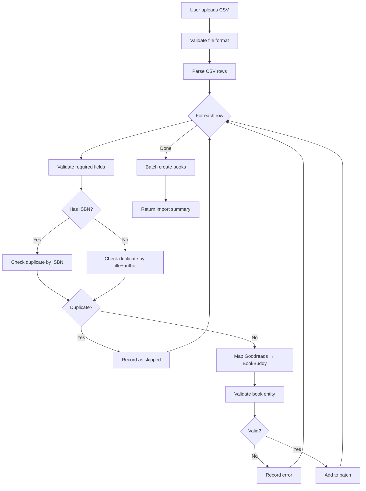

# Goodreads Import Feature - Technical Design Document

## 1. Overview

This document outlines the design for importing books from Goodreads CSV exports into the BookBuddy application. The feature will allow users to bulk-import their reading history while maintaining BookBuddy's clean architecture and data integrity.

## 2. Goodreads CSV Format Specification

### 2.1 Standard Fields

Based on the sample export file, Goodreads provides the following fields:

| Field Name | Type | Description | Example |
|------------|------|-------------|---------|
| `Book Id` | Number | Goodreads internal book ID | `55595995` |
| `Title` | String | Book title (may include series info) | `"Bloodline (Cradle, #9)"` |
| `Author` | String | Primary author name | `Will Wight` |
| `Author l-f` | String | Author in last-first format | `"Wight, Will"` |
| `Additional Authors` | String | Co-authors, translators (comma-separated) | `"Marion Wiesel, François Mauriac"` |
| `ISBN` | String | ISBN-10 (wrapped in formula) | `="0374500010"` |
| `ISBN13` | String | ISBN-13 (wrapped in formula) | `="9780374500016"` |
| `My Rating` | Number | User's rating (0-5, 0 = unrated) | `5` |
| `Average Rating` | Number | Goodreads average rating | `4.50` |
| `Publisher` | String | Publisher name | `Hidden Gnome Publishing` |
| `Binding` | String | Format (Kindle, Paperback, Hardcover, etc.) | `Kindle Edition` |
| `Number of Pages` | Number | Page count | `378` |
| `Year Published` | Number | Publication year | `2021` |
| `Original Publication Year` | Number | Original publication year | `2021` |
| `Date Read` | Date | Date finished (YYYY/MM/DD) | `2022/01/16` |
| `Date Added` | Date | Date added to Goodreads (YYYY/MM/DD) | `2022/01/12` |
| `Bookshelves` | String | Shelf names (comma-separated) | `currently-reading` |
| `Bookshelves with positions` | String | Shelves with position numbers | `currently-reading (#1)` |
| `Exclusive Shelf` | String | Primary shelf (want-to-read, reading, read) | `read` |
| `My Review` | String | User's review text | (empty in sample) |
| `Spoiler` | String | Spoiler warning flag | (empty in sample) |
| `Private Notes` | String | Private notes | (empty in sample) |
| `Read Count` | Number | Times read | `1` |
| `Owned Copies` | Number | Number of owned copies | `0` |

### 2.2 Data Quality Observations

From the sample file:
- **ISBN Handling**: ISBNs are wrapped in Excel formulas (`="123456789"`) to preserve leading zeros
- **Missing ISBNs**: Many books (especially self-published) have empty ISBNs (`=""`)
- **Series Information**: Often embedded in title (`"Bloodline (Cradle, #9)"`)
- **Status Mapping**: `Exclusive Shelf` contains: `to-read`, `currently-reading`, or `read`
- **Date Format**: Dates use `YYYY/MM/DD` format
- **Empty Fields**: Many optional fields are empty strings

## 3. BookBuddy Architecture Analysis

### 3.1 Current Book Entity Structure

```typescript
interface Book {
  id: string;                    // UUID
  userId: string;                // Owner ID
  googleBooksId: string;         // External reference
  title: string;
  authors: string[];             // Array of author names
  thumbnail?: string;            // Cover image URL
  description?: string;
  pageCount?: number;
  status: BookStatus;            // 'want-to-read' | 'reading' | 'read'
  currentPage?: number;
  rating?: number;               // 1-5
  addedAt: Date;
  finishedAt?: Date;
  genres: string[];              // User-assigned tags
}
```

### 3.2 Existing Integration Points

1. **Add Book Use Case** ([`application/use-cases/books/add-book.ts`](application/use-cases/books/add-book.ts:1))
   - Validates duplicate books via `existsByGoogleBooksId()`
   - Throws `DuplicateError` if book exists
   - Creates books one at a time

2. **Book Repository** ([`infrastructure/persistence/prisma/book-repository.ts`](infrastructure/persistence/prisma/book-repository.ts:1))
   - `create()` - Creates single book
   - `existsByGoogleBooksId()` - Checks for duplicates
   - No batch operations currently

3. **External Book Search** ([`infrastructure/external/google-books-client.ts`](infrastructure/external/google-books-client.ts:1))
   - Shows pattern for external data integration
   - Demonstrates filtering and data mapping

## 4. Field Mapping Strategy

### 4.1 Direct Mappings

| Goodreads Field | BookBuddy Field | Transformation |
|-----------------|-----------------|----------------|
| `Title` | `title` | Strip series info (optional) |
| `Author` + `Additional Authors` | `authors` | Combine into array |
| `Number of Pages` | `pageCount` | Direct copy (if > 0) |
| `My Rating` | `rating` | Only if > 0 and status = 'read' |
| `Date Added` | `addedAt` | Parse YYYY/MM/DD to Date |
| `Date Read` | `finishedAt` | Parse YYYY/MM/DD to Date (if status = 'read') |
| `Bookshelves` | `genres` | Split by comma, filter out status shelves |

### 4.2 Status Mapping

| Goodreads `Exclusive Shelf` | BookBuddy `status` |
|----------------------------|-------------------|
| `to-read` | `want-to-read` |
| `currently-reading` | `reading` |
| `read` | `read` |

### 4.3 Special Handling

#### 4.3.1 ISBN Processing
```typescript
// Extract ISBN from Excel formula format
function extractISBN(value: string): string | undefined {
  // Remove ="..." wrapper
  const cleaned = value.replace(/^="(.*)"$/, '$1');
  return cleaned.length > 0 ? cleaned : undefined;
}
```

#### 4.3.2 Google Books ID Generation
Since Goodreads doesn't provide Google Books IDs:
- **Option A**: Use `goodreads-{bookId}` as placeholder (simple, enables duplicate detection)
- **Option B**: Search Google Books API by ISBN/title (complex, slow, may fail)
- **Recommendation**: Option A with future enhancement for Option B

#### 4.3.3 Thumbnail Handling
Goodreads doesn't provide image URLs:
- Leave `thumbnail` field empty
- Future enhancement: Fetch from Google Books API using ISBN

#### 4.3.4 Genre/Shelf Processing
```typescript
// Filter out status shelves, keep custom shelves
const STATUS_SHELVES = ['to-read', 'currently-reading', 'read', 'favorites'];
const genres = bookshelves
  .split(',')
  .map(s => s.trim())
  .filter(s => !STATUS_SHELVES.includes(s));
```

## 5. Duplicate Detection Strategy

### 5.1 Primary Strategy: ISBN-Based

```typescript
// Check for existing book by ISBN (if available)
if (isbn13 || isbn10) {
  // Search by ISBN in existing books
  // Match on exact ISBN or fuzzy match on title+author
}
```

### 5.2 Secondary Strategy: Title + Author

For books without ISBNs:
```typescript
// Normalize and compare
function normalizeTitle(title: string): string {
  return title
    .toLowerCase()
    .replace(/[^\w\s]/g, '')  // Remove punctuation
    .replace(/\s+/g, ' ')      // Normalize whitespace
    .trim();
}

// Match if normalized title + first author matches
```

### 5.3 Proposed Repository Enhancement

Add to [`IBookRepository`](domain/interfaces/book-repository.ts:15):

```typescript
interface IBookRepository {
  // ... existing methods ...
  
  /**
   * Find books by ISBN (checks both ISBN-10 and ISBN-13)
   */
  findByISBN(userId: string, isbn: string): Promise<Book | undefined>;
  
  /**
   * Find books by normalized title and author
   */
  findByTitleAndAuthor(
    userId: string, 
    title: string, 
    author: string
  ): Promise<Book[]>;
  
  /**
   * Batch create books (for import operations)
   */
  createMany(books: Book[]): Promise<Book[]>;
}
```

## 6. Import Flow Architecture

### 6.1 Layer Organization

```
┌─────────────────────────────────────────────────────────┐
│ API Layer (Vercel Serverless)                          │
│ - POST /api/books/import                                │
│ - Handles file upload (multipart/form-data)            │
│ - Enforces file size limits (10MB max)                 │
└─────────────────────────┬───────────────────────────────┘
                          │
┌─────────────────────────▼───────────────────────────────┐
│ Application Layer                                       │
│ - ImportGoodreadsLibraryUseCase                        │
│   * Orchestrates import process                         │
│   * Handles errors and validation                       │
│   * Returns import summary                              │
└─────────────────────────┬───────────────────────────────┘
                          │
          ┌───────────────┼───────────────┐
          │               │               │
┌─────────▼─────┐ ┌──────▼──────┐ ┌─────▼─────────┐
│ CSV Parser    │ │ Goodreads   │ │ Book          │
│ Service       │ │ Mapper      │ │ Repository    │
│ (infra)       │ │ Service     │ │ (domain)      │
│               │ │ (domain)    │ │               │
└───────────────┘ └─────────────┘ └───────────────┘
```

### 6.2 File Structure

New files to create:

```
domain/
  interfaces/
    csv-parser.ts              # Interface for CSV parsing
    goodreads-importer.ts      # Interface for import service
  services/
    goodreads-mapper.ts        # Maps Goodreads data to Book entities

application/
  use-cases/
    books/
      import-goodreads.ts      # Main import orchestration

infrastructure/
  parsers/
    csv-parser.ts              # CSV parsing implementation (papaparse)
  
api/
  books/
    import.ts                  # API endpoint handler
```

### 6.3 Import Process Flow



## 7. Error Handling Strategy

### 7.1 Error Categories

1. **File-level errors** (abort entire import)
   - Invalid file format
   - File too large
   - Missing required headers
   - Corrupted CSV

2. **Row-level errors** (skip row, continue import)
   - Missing required fields (Title, Author)
   - Invalid data types
   - Duplicate books
   - Validation failures

### 7.2 Import Result Structure

```typescript
interface ImportResult {
  summary: {
    totalRows: number;
    successful: number;
    skipped: number;
    failed: number;
  };
  
  errors: Array<{
    row: number;
    title: string;
    error: string;
    severity: 'warning' | 'error';
  }>;
  
  skipped: Array<{
    row: number;
    title: string;
    reason: string;  // 'duplicate' | 'already-exists'
  }>;
}
```

### 7.3 Error Recovery Strategy

**Philosophy**: Partial success is better than complete failure

- **Skip failed rows**: Continue processing remaining books
- **Log all errors**: Return detailed error report
- **No rollback**: Keep successfully imported books
- **User notification**: Clear summary of what succeeded/failed

## 8. Schema Changes

### 8.1 Book Table Modifications

**Current limitation**: `googleBooksId` is required but Goodreads books don't have it.

**Proposed change** to [`prisma/schema.prisma`](prisma/schema.prisma:30):

```prisma
model Book {
  id            String    @id @default(uuid())
  userId        String
  googleBooksId String?   // Make optional (currently required)
  
  // New fields for Goodreads support
  goodreadsId   String?   // Store Goodreads book ID
  isbn          String?   // Store ISBN for better duplicate detection
  isbn13        String?   // Store ISBN-13
  
  // ... existing fields ...
  
  @@unique([userId, googleBooksId])  // Keep existing constraint
  @@unique([userId, goodreadsId])    // Prevent duplicate Goodreads imports
  @@index([userId, isbn])            // Index for ISBN lookup
  @@index([userId, isbn13])          // Index for ISBN-13 lookup
}
```

### 8.2 Migration Considerations

1. Make `googleBooksId` nullable
2. Add new fields: `goodreadsId`, `isbn`, `isbn13`
3. Update unique constraints
4. Add indexes for performance
5. **Data migration**: Set `googleBooksId = 'goodreads-' + goodreadsId` for existing Goodreads imports

## 9. API Endpoint Design

### 9.1 Import Endpoint

```typescript
POST /api/books/import

Headers:
  Authorization: Bearer <token>
  Content-Type: multipart/form-data

Body:
  file: <CSV file>
  options: {
    skipDuplicates: boolean;      // Default: true
    updateExisting: boolean;      // Default: false (future)
  }

Response: 200 OK
{
  summary: {
    totalRows: 70,
    successful: 65,
    skipped: 3,
    failed: 2
  },
  errors: [
    {
      row: 15,
      title: "Invalid Book",
      error: "Missing required field: Author",
      severity: "error"
    }
  ],
  skipped: [
    {
      row: 5,
      title: "Existing Book",
      reason: "duplicate"
    }
  ]
}

Errors:
  400 - Invalid file format
  413 - File too large
  422 - Invalid CSV structure
  500 - Server error
```

## 10. Performance Considerations

### 10.1 File Size Limits

- **Maximum file size**: 10MB (handles ~50,000 books)
- **Maximum rows**: 10,000 books per import
- **Timeout**: 60 seconds (Vercel serverless limit)

### 10.2 Optimization Strategies

1. **Batch Processing**
   - Group books into batches of 100
   - Use `createMany()` for batch inserts
   - Reduces database round-trips

2. **Streaming Parse**
   - Use streaming CSV parser (papaparse)
   - Process rows incrementally
   - Avoid loading entire file in memory

3. **Parallel Validation**
   - Validate rows in parallel
   - Duplicate checks can be batched
   - Use Promise.all() for concurrent operations

4. **Database Optimization**
   - Add indexes on ISBN fields
   - Use prepared statements
   - Batch duplicate checks (WHERE IN query)

### 10.3 Large Import Handling

For imports > 10,000 books:
- **Phase 1**: Support synchronous import (current design)
- **Phase 2** (future): Background job processing
  - Queue import job
  - Process asynchronously
  - Email user when complete

## 11. Testing Strategy

### 11.1 Test Cases

1. **Valid CSV Import**
   - Import 10 books successfully
   - Verify all fields mapped correctly
   - Check status mapping

2. **Duplicate Detection**
   - Import same book twice
   - Verify second import skipped
   - Test ISBN-based duplicate
   - Test title+author duplicate

3. **Partial Data**
   - Books without ISBN
   - Books without page count
   - Books without ratings
   - Verify graceful handling

4. **Error Handling**
   - Invalid CSV format
   - Missing required headers
   - Missing required fields (title, author)
   - Corrupted data

5. **Edge Cases**
   - Empty CSV
   - CSV with only headers
   - Books with special characters
   - Very long titles/descriptions
   - Multiple authors

### 11.2 Test Data

Create test fixtures:
- `tests/fixtures/goodreads-sample.csv` - Valid 10-book export
- `tests/fixtures/goodreads-duplicates.csv` - Contains duplicates
- `tests/fixtures/goodreads-invalid.csv` - Missing required fields
- `tests/fixtures/goodreads-empty.csv` - No data rows

## 12. Implementation Phases

### Phase 1: Core Import (MVP)
- [ ] Create domain interfaces
- [ ] Implement CSV parser
- [ ] Implement Goodreads mapper
- [ ] Create import use case
- [ ] Add API endpoint
- [ ] Update Prisma schema
- [ ] Add duplicate detection (ISBN + title/author)
- [ ] Basic error handling

### Phase 2: Enhanced Features
- [ ] Google Books API enrichment (fetch covers, descriptions)
- [ ] Update existing books option
- [ ] Custom field mapping options
- [ ] Preview import before commit

### Phase 3: Advanced Features
- [ ] Background job processing for large imports
- [ ] Import from other sources (LibraryThing, etc.)
- [ ] Export to Goodreads format
- [ ] Import history tracking

## 13. Security Considerations

1. **File Upload Security**
   - Validate file extension (.csv only)
   - Check MIME type
   - Enforce file size limits
   - Scan for malicious content

2. **CSV Injection Protection**
   - Sanitize cell values
   - Escape formulas (=, +, -, @)
   - Validate data types

3. **Rate Limiting**
   - Limit import frequency (1 per minute per user)
   - Track import attempts
   - Prevent abuse

4. **Data Validation**
   - Validate all inputs
   - Sanitize strings
   - Check data types
   - Enforce business rules

## 14. User Experience Considerations

1. **Progress Indication**
   - Show upload progress
   - Display parsing status
   - Show import progress (X of Y books)

2. **Error Communication**
   - Clear error messages
   - Suggest fixes
   - Provide examples

3. **Success Feedback**
   - Show import summary
   - Highlight any issues
   - Link to imported books

4. **Documentation**
   - Provide sample CSV format
   - Explain field mapping
   - FAQ for common issues

## 15. Future Enhancements

1. **Google Books Enrichment**
   - Auto-fetch covers and descriptions via ISBN
   - Update metadata for existing books
   - Batch API calls for efficiency

2. **Smart Duplicate Merging**
   - Detect similar books
   - Suggest merges
   - Preserve user data (ratings, status)

3. **Import Scheduling**
   - Auto-sync with Goodreads
   - Periodic incremental imports
   - Webhook support

4. **Multi-source Import**
   - LibraryThing
   - StoryGraph
   - Amazon reading list
   - Generic CSV format

5. **Export Feature**
   - Export to Goodreads format
   - Export to other formats
   - Backup functionality

## 16. Dependencies

### 16.1 New NPM Packages

```json
{
  "papaparse": "^5.4.1",        // CSV parsing
  "@types/papaparse": "^5.3.7"  // TypeScript types
}
```

### 16.2 Existing Dependencies

- Prisma (database)
- Zod (validation - optional)
- Express/Vercel (API layer)

## 17. Open Questions

1. **Should we support updating existing books during import?**
   - Pro: Keeps data in sync with Goodreads
   - Con: May overwrite user changes
   - **Recommendation**: Not in MVP, add in Phase 2 with user opt-in

2. **Should we enrich data with Google Books API during import?**
   - Pro: Better data quality, cover images
   - Con: Slower imports, API rate limits
   - **Recommendation**: Not during import, add as background job

3. **How to handle books that can't be matched to Google Books?**
   - **Recommendation**: Store with `googleBooksId = 'goodreads-{id}'`

4. **Should we preserve Goodreads reviews and notes?**
   - Requires adding `notes` or `review` field to Book entity
   - **Recommendation**: Add in Phase 2 if user demand exists

## 18. Success Metrics

1. **Import Success Rate**: > 95% of books imported without errors
2. **Performance**: Import 100 books in < 5 seconds
3. **Duplicate Detection Accuracy**: > 98% accuracy
4. **User Satisfaction**: Positive feedback on import experience

## 19. Risks and Mitigations

| Risk | Impact | Mitigation |
|------|--------|------------|
| ISBN format variations | Medium | Support multiple ISBN formats, fuzzy matching |
| Missing ISBNs | High | Implement title+author fallback matching |
| Large file imports timing out | Medium | Implement batch processing, background jobs (Phase 2) |
| Duplicate detection false positives | High | Manual review option, conservative matching |
| Data loss during import | Critical | Transaction-based imports, rollback on critical errors |
| Goodreads format changes | Low | Version detection, graceful degradation |

## 20. Conclusion

This design provides a robust foundation for Goodreads import functionality while maintaining BookBuddy's clean architecture. The phased approach allows for MVP delivery with clear paths for enhancement. The focus on error handling and user experience ensures a smooth import process even with imperfect data.

**Next Steps**: Review this design with the team, gather feedback, and proceed with Phase 1 implementation in Code mode.